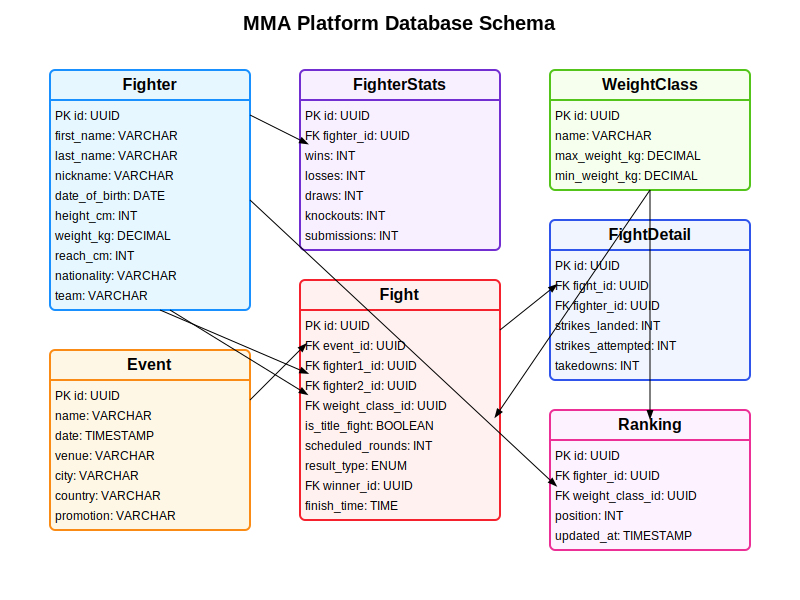

# MMA Platform API

A GraphQL API for a platform that offers mixed martial arts (MMA) event information, fighter rankings, and statistics, similar to Sherdog.com and tapology.com.

## Features

- Comprehensive database schema for MMA data
- GraphQL API for querying and mutating data
- TypeORM integration for database operations
- Docker and Docker Compose setup for easy deployment
- Makefile for common development tasks

## Database Schema

The database schema includes the following entities:

- **Fighter**: Basic fighter information (name, height, weight, etc.)
- **FighterStats**: Fighter record statistics (wins, losses, KOs, etc.)
- **WeightClass**: Weight divisions (Heavyweight, Lightweight, etc.)
- **Event**: MMA events (UFC 300, Bellator 290, etc.)
- **Fight**: Individual fights within events
- **FightDetail**: Detailed fight statistics
- **Ranking**: Fighter rankings within weight classes

### Entity Relationship Diagram

Below is the Entity Relationship Diagram (ERD) for the MMA Platform database:



## Quick Start Guide

Follow these steps to get the MMA Platform up and running:

```bash
# Clone the repository
git clone https://github.com/noel319/mma-platform-api.git
cd mma-platform-api

# Build the Docker containers
make build

# Start the application
make run

# Initialize the database schema
make init-db

# Seed the database with initial data
make seed

# Access the GraphQL playground
# Open http://localhost:4000/graphql in your browser
```

## Technology Stack

- **Node.js** with TypeScript
- **Express** as the web server
- **Apollo Server** for GraphQL
- **TypeORM** for database operations
- **PostgreSQL** as the database
- **Docker** and Docker Compose for containerization
- **Jest** for testing

## Getting Started

### Prerequisites

- Docker and Docker Compose
- Node.js 16+ (for local development)
- npm or yarn

### Installation

1. Clone the repository:
   ```bash
   git clone https://github.com/noel319/mma-platform-api.git
   cd mma-platform-api
   ```

2. Set up environment variables (optional, defaults are provided):
   ```bash
   cp .env.example .env
   ```

3. Build and start the application using Docker:
   ```bash
   make build
   make run
   ```

4. Initialize the database schema:
   ```bash
   make init-db
   ```

5. Seed the database with initial data:
   ```bash
   make seed
   ```

6. Access the GraphQL playground at http://localhost:4000/graphql

### Development

- **Start the development server**:
  ```bash
  npm run dev
  ```

- **Run linting**:
  ```bash
  make lint
  ```

- **Run tests**:
  ```bash
  make test
  ```

### Common Makefile Commands

The project includes a Makefile with the following useful commands:

```bash
# Build the Docker containers
make build

# Start the application
make run

# Stop the application
make stop

# Run tests
make test

# Run linting
make lint

# View logs
make logs

# Access PostgreSQL command line
make psql

# Clean up containers and volumes
make clean

# Check container status
make status
```

## API Documentation

### GraphQL Schema

The API provides the following main queries and mutations:

#### Queries

- **fighters**: List all fighters
- **fighter(id)**: Get a fighter by ID
- **searchFighters(searchTerm)**: Search fighters by name
- **events**: List all events
- **upcomingEvents**: List upcoming events
- **pastEvents**: List past events
- **event(id)**: Get an event by ID
- **fights**: List all fights
- **fight(id)**: Get a fight by ID
- **fighterFights(fighterId)**: Get fights for a specific fighter
- **weightClasses**: List all weight classes
- **weightClass(id)**: Get a weight class by ID
- **rankings(weightClassId)**: Get rankings, optionally filtered by weight class
- **currentRankingsByWeightClass(weightClassId)**: Get current rankings for a weight class

#### Mutations

- **createFighter**: Create a new fighter
- **updateFighter**: Update a fighter
- **deleteFighter**: Delete a fighter
- **createEvent**: Create a new event
- **updateEvent**: Update an event
- **deleteEvent**: Delete an event
- **createFight**: Create a new fight
- **updateFight**: Update a fight
- **recordFightResult**: Record the result of a fight
- **addFightDetail**: Add performance details for a fighter in a fight
- **createWeightClass**: Create a new weight class
- **updateWeightClass**: Update a weight class
- **deleteWeightClass**: Delete a weight class

### Example Queries

#### Get a Fighter with Stats

```graphql
query {
  fighter(id: "fighter-id") {
    id
    firstName
    lastName
    nickname
    heightCm
    weightKg
    nationality
    stats {
      wins
      losses
      draws
      knockouts
      submissions
    }
    currentRankings {
      weightClass {
        name
      }
      position
    }
  }
}
```

#### Get Upcoming Events

```graphql
query {
  upcomingEvents(limit: 5) {
    id
    name
    date
    venue
    city
    country
    fights {
      fighter1 {
        firstName
        lastName
      }
      fighter2 {
        firstName
        lastName
      }
      weightClass {
        name
      }
      isTitleFight
      isMainEvent
    }
  }
}
```

#### Record a Fight Result

```graphql
mutation {
  recordFightResult(
    id: "fight-id",
    data: {
      resultType: KNOCKOUT,
      winnerId: "fighter-id",
      finishRound: 2,
      finishTime: "04:59",
      actualRounds: 2
    }
  ) {
    id
    resultType
    winner {
      firstName
      lastName
    }
  }
}
```

## Project Structure

The project follows a modular, feature-based organization:

```
mma-platform-api/
├── src/                       # Source code directory
│   ├── entities/              # TypeORM entity definitions
│   ├── inputs/                # GraphQL input type definitions
│   ├── resolvers/             # GraphQL resolvers
│   ├── types/                 # TypeScript type definitions
│   ├── config.ts              # Configuration settings
│   ├── index.ts               # Application entry point
│   └── seed.ts                # Database seeding script
├── docs/                      # Documentation files
│   └── mma-platform-erd.png   # Database schema diagram
├── Dockerfile                 # Docker image definition
├── docker-compose.yml         # Docker Compose configuration
├── init.sql                   # Initial SQL schema for database
├── Makefile                   # Make commands for common tasks
└── [Other configuration files]
```

## Architecture

The application follows a layered architecture:

- **Entities Layer**: TypeORM entities representing database tables
- **Repository Layer**: TypeORM repositories for database access
- **Resolver Layer**: GraphQL resolvers handling queries and mutations
- **Service Layer**: Business logic and data processing

## License

This project is licensed under the MIT License.

## Acknowledgements

- [TypeORM](https://typeorm.io/)
- [Apollo Server](https://www.apollographql.com/docs/apollo-server/)
- [Type-GraphQL](https://typegraphql.com/)